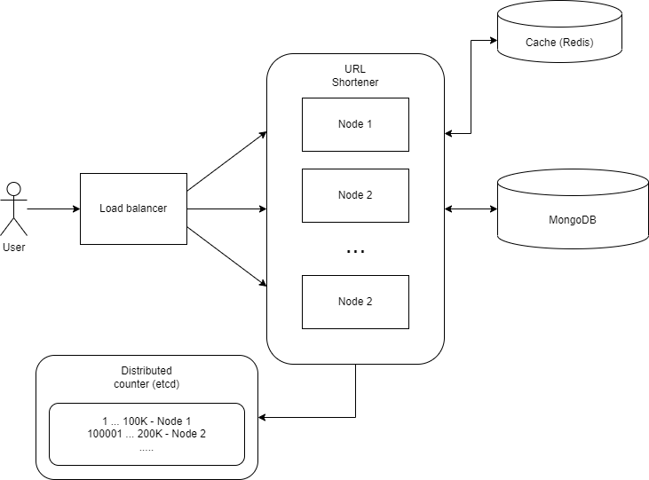

# shortener

Distributed URL shortener service.

- Get short URL from a long URL
- Redirect to long URL when a user clicks on the short URL
- Delete short URL`s

## Run 
Easy to run: `docker compose up -d`  
Easy to test: import [postman collection](./shortener.postman_collection.json)  
Full integration test support: `make test-integration`

